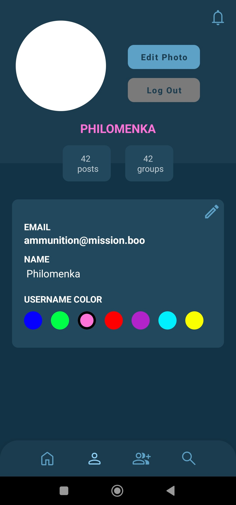
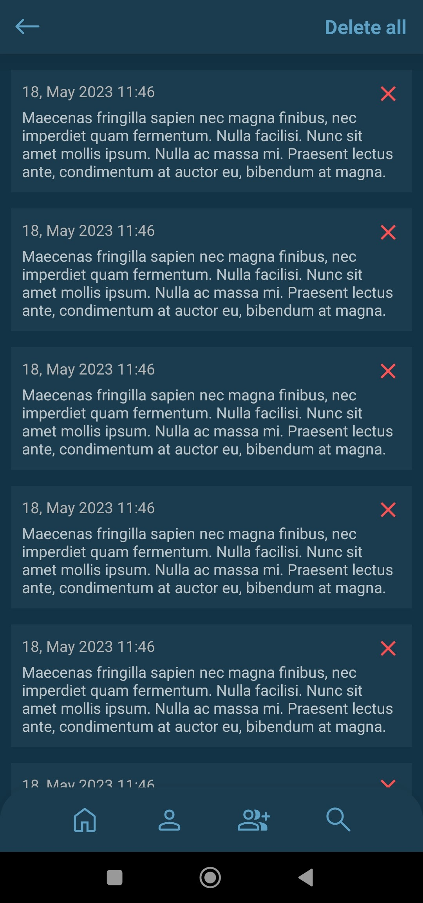

## Stellar - frontend

An android application - social network for students and study groups.

Copyright &copy; 2023. All rights reserved.

### Project overview:

Users can:

- register & log in
- edit their profile (including profile pic)
- see their various in-app stats
- create & design groups:
    - choose unique group name
    - choose group category
    - choose group icon & colors
- edit or delete own groups
- join foreign groups
- publish posts in groups:
    - create new posts or reply to existing ones
    - show their current location on posts (optional)
    - share photos together with text (optional)
- search up groups (by name or category)
- receive push notifications regarding different events
- browse & delete list of received notifications

The application supports:

- accessing of location (GPS or network)
- accessing of camera
- accessing of gallery
- offline caching of requests (in case of no internet connection)
- push notifications

### Team members:

- Ján Ágh
- Irina Makarova

### Technology:

- Kotlin
- XML

### Design overview

Login Activity             |  Register Activity
:-------------------------:|:-------------------------:
  |  

Main Activity              |  Profile Activity
:-------------------------:|:-------------------------:
  |  

Create Group Activity      |  Create Post Activity
:-------------------------:|:-------------------------:
  |  

Search Activity            |  Notifications Activity
:-------------------------:|:-------------------------:
  |  